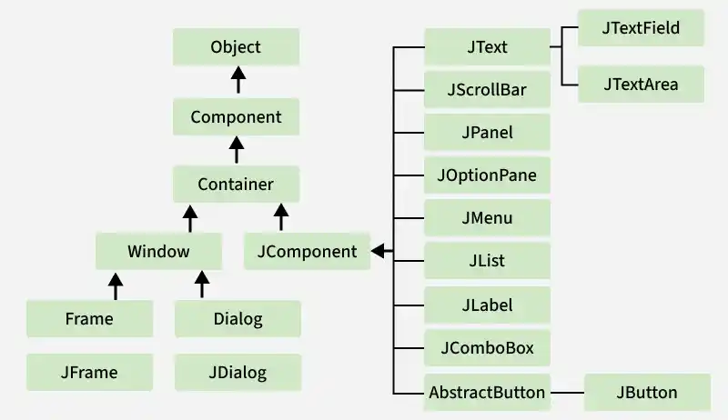

# Introduction to Java Swing

**Swing** is a set of Java components that are used to build Graphical User Interface (GUI) applications.
Java Swing is a GUI (Graphical User Interface) toolkit that is part of the Java Foundation Classes (JFC).
It provides a rich set of lightweight components for building desktop applications with a more flexible 
and feature-rich interface than AWT(Abstract Window Toolkit).

## Swing Classes Hierarchy

## Features Of Swing Class  
- **Platform Independent** : Swing components provide a consistent GUI across different operating systems without depending on native OS controls.
- **Lightweight Components** : Swing components are written entirely in Java and do not rely on platform-specific system resources.
- **Pluggable Look and Feel** : Swing allows the appearance of components to be changed dynamically without modifying the application code.
- **MVC Architecture** : Swing follows the Model-View-Controller (MVC) pattern, separating data, UI, and control logic.
- **Highly Customizable** : Swing components can be easily customized to match specific application requirements.
- **Rich Set of Controls** : Swing provides advanced GUI components such as JTable, JTree, JTabbedPane, and JScrollPane.
- **Advanced Event Handling** : Swing offers a robust event-handling mechanism to efficiently respond to user actions.

## Advantages of Swing over AWT
- Swing components provide more flexibility and advanced features compared to AWT components.
- Image Support : Swing components such as buttons and labels can display images along with or instead of text.
- Custom Borders : Borders of Swing components can be easily customized to improve the UI appearance.
- Non-Rectangular Components : Swing allows components such as buttons to have custom shapes, including round buttons.
- Accessibility Support : Swing integrates well with assistive technologies like screen readers, making applications more accessible to users with disabilities.

### Reference

- https://docs.oracle.com/javase/8/docs/technotes/guides/swing/
- https://docs.oracle.com/javase/tutorial/uiswing/index.html
- https://www.geeksforgeeks.org/java/introduction-to-java-swing/
- https://www.tutorialspoint.com/swing/index.htm